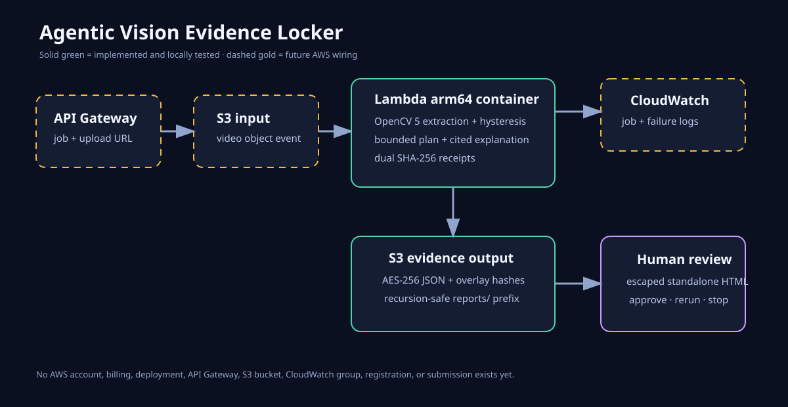

# Evidence Locker — Agentic Vision with OpenCV 5

This repository is the reproducible source package for the **Evidence Locker**
OpenCV AI Competition 2026 project. It turns a video into deterministic evidence
cards containing the changed frame, timestamp, changed bounding boxes, and
hashes of the exact before/after frames. A bounded review planner then changes
its next action based on those cards: complete, rerun extraction, seal localized
evidence, or request human approval. The canonical report is sealed with a
separate SHA-256 receipt.

The implemented explanation layer may cite only extracted frame evidence and the
policy-selected action; it must not invent visual facts that OpenCV did not
extract. Local and container results below are verified. A live AWS deployment,
contest award, and payment are not claimed.

- [Three-minute demo video](https://github.com/tzh476/opencv-evidence-locker/releases/download/demo-v1/opencv-evidence-locker.mp4)
- [Technical report](Evidence-Locker-Technical-Report.pdf)
- [Bounded AWS architecture](architecture.svg)

## Verify

```bash
python3 -m venv .venv
.venv/bin/pip install -r requirements.txt
.venv/bin/python -m unittest -v
```

Build and test the Lambda-compatible arm64 container locally without pushing it:

```bash
docker build --platform linux/arm64 -t agentic-vision-evidence-locker:spike .
docker run --rm --platform linux/arm64 --entrypoint python agentic-vision-evidence-locker:spike -m unittest -v
```

Validate the bounded AWS SAM template locally (this creates no AWS resources):

```bash
.venv/bin/python -m unittest -v test_infrastructure.py
```

`template.yaml` creates two private AES-256-encrypted S3 buckets, an arm64
container Lambda, a single `incoming/*.mp4` event boundary, two reserved
concurrent executions, fourteen-day logs, and configurable 1-30 day object
retention (seven days by default). The template is deployment preparation only;
it is not evidence that any AWS resource or endpoint exists.

Analyze a local video without uploading it:

```bash
.venv/bin/python evidence_locker.py input.mp4 --output evidence.json --overlay-dir overlays
```

Run the deterministic four-scenario evaluation:

```bash
.venv/bin/python evaluate_synthetic.py
```

Render a standalone human-review page next to the generated overlays:

```bash
.venv/bin/python report_ui.py evidence.json --output overlays/review.html
```

## Spike acceptance criteria

- Runs against `opencv-python==5.0.0.93`.
- Emits no event for identical frames and completes without escalation.
- Detects and deterministically orders multiple changed regions.
- Uses hysteresis: an event must fall below a reset threshold before another
  evidence card can fire, preventing continuous-motion event floods.
- Hashes the exact frame shape, dtype, and bytes.
- Rejects shape and dtype mismatches instead of silently normalizing evidence.
- Fails closed into a rerun when a frame-level event has no reviewable region.
- Requests human approval for a material transition and seals the report.
- Renders hash-addressed review overlays without modifying source frames.
- Escapes report data and renders a standalone decision-and-evidence review page.
- Constrains the explanation layer to known frame ids and the bounded OpenCV
  review action; unknown claims or unapproved actions fail closed.
- Performs no network, cloud, account, billing, or external write.

## Next technical boundary

The local build now has a human-review UI, a fail-closed evidence explanation
boundary, a deterministic smoke evaluation, a Lambda adapter, and a bounded SAM
template. The remaining competition-critical boundary is a real AWS deployment
using right-cleared input, with captured logs, latency, cost, storage receipts,
and an arranged live demonstration or judge-accessible endpoint. None of those
deployment claims are made by the local build.

`lambda_handler.py` now provides a locally tested boundary for the proposed AWS
path: one S3 object event downloads a video, runs the same OpenCV evidence
pipeline, and writes an AES-256 server-side-encrypted JSON report to a separate
S3 prefix. It rejects batches and output-recursion events. The adapter has not
been deployed, connected to API Gateway, or exercised against a real AWS account.



## Verified result — 2026-08-31

The isolated environment reported OpenCV `5.0.0`; all thirty-one tests passed
from a clean install. A 20-frame, 10 FPS synthetic black-to-white video produced
exactly one evidence card at frame 10 / 1,000 ms, with a `0.992157` normalized change score,
one `(0, 0, 160, 100)` region, and distinct SHA-256 hashes for the previous and
current frames. The planner selected `request_human_approval`, and the canonical
report receipt was `7fa0a95b5df55085182e0663c5968a38e8b1d647fef5e031308d278e82976d9c`.
The generated synthetic video and JSON remained under `/tmp`; the repository
records the deterministic assertions and receipt rather than temporary output.

The seeded four-scenario evaluation covers no change, localized change,
full-frame change, and low-amplitude noise. It currently reports two true
positives, two true negatives, zero false positives, zero false negatives, and
100% action selection accuracy. This is a smoke-sized synthetic evaluation, not
evidence of production accuracy; licensed real-world samples are still needed.

A read-only run against OpenCV's public `opencv_extra` Big Buck Bunny MP4 test
sample exposed event flooding in the first implementation: 56 cards across 125
frames. Hysteresis and two regression tests reduced that to one card without
disabling re-arming after a quiet frame. The corrected report receipt is
`13a3d89482c0ea6f6ccd2082c1268fb46c383c8f1100565e7bddf7ad57c6c61c`.
This single public sample proves the regression fix, not general accuracy.

The first review overlay still contained many tiny contour boxes. An adaptive
minimum area (`max(16px, 0.2% of the frame)`) and a tiny-speck regression test
reduced that sample from dozens of boxes to four reviewable regions while
preserving the main subject. The corrected overlay SHA-256 is
`5acece4631ad46ccf4bca97d125a9ae1c26e6fc1d9577af85e822418c5e75ef9`.

Three public `opencv_extra/5.x` videos with different sizes and metadata were
then processed under OpenCV 5 without crashes or uploads:

| Sample source SHA-256 | Frames | Events | Action |
|---|---:|---:|---|
| `4e28622467284da93f7575189c84f0e762b170bb7cf19667ca52929f93dcc238` | 125 | 1 | seal evidence |
| `c433da3c2354a19324f606300753be7942cf3970e879e081bca749bd9041445c` | 15 | 1 | seal evidence |
| `fbf61d51ea8a2d1218c4fb898c6b31acf661d578040dd964447532b1f66a6c77` | 54 | 2 | seal evidence |

Repeating the 15-frame H.264 sample produced identical evidence cards and the
same report receipt (`39584d0272d96679c591d87f1836fbe44e0635adc6e835b35b030a0686dc5ced`).
The samples remain in `/tmp`; this repository records hashes and bounded results,
not the media.

Before any cloud deployment, the local gate is: all tests pass; the seeded
positive/negative set has zero FP/FN; repeated input yields the same receipt;
each public sample completes; and event density stays below 10% of frames. These
are engineering gates for the spike, not claims of real-world precision or recall.

The standalone review HTML was rendered in headless Chrome at 1280 x 1200 and
visually checked. It showed the decision reason, four-region overlay, exact frame
hashes, and report receipt without clipping. The screenshot remained in `/tmp`.

The bounded explanation layer was integrated into the sealed report. On the
15-frame H.264 sample it cited only frame 1, summarized three extracted regions
and a `0.174708` maximum change, and preserved the policy-selected
`seal_evidence_for_agent_summary` action. Tests reject unknown frame citations
and any recommendation that differs from the bounded plan.

The Lambda-compatible image was then built locally from
`public.ecr.aws/lambda/python:3.13-arm64`. Inside that image, Python reported
`aarch64`, OpenCV reported `5.0.0`, and all twenty-six runtime tests passed again;
the five SAM-template tests run on the host. The
architecture SVG was rendered to a 1,200 x 620 PNG in headless Chrome and
visually checked. No image was pushed to a registry and no AWS resource was
created.
